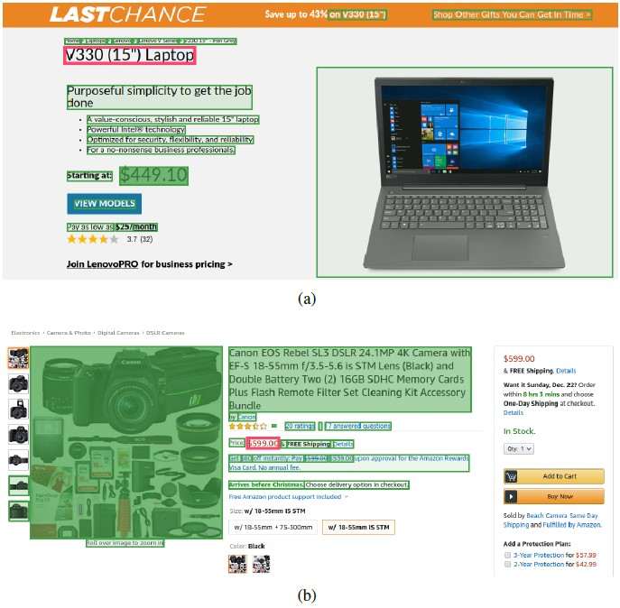

# CoVA: Context-aware Visual Attention for Webpage Information Extraction

## Abstract
Webpage information extraction (WIE) is an important step to create knowledge bases. For this, classical WIE methods leverage the Document Object Model (DOM) tree of a website. However, use of the DOM tree poses significant challenges as context and appearance are encoded in an abstract manner. To address this challenge we propose to `reformulate WIE as a context-aware Webpage Object Detection task`. Specifically, we develop a Context-aware Visual Attention-based (CoVA) detection pipeline which combines appearance features with syntactical structure from the DOM tree. To study the approach we collect a `new large-scale dataset of e-commerce websites` for which we manually annotate every web element with four labels: product price, product title, product image and background. On this dataset we show that the proposed CoVA approach is a new challenging baseline which improves upon prior
state-of-the-art methods.

<!--
## Key Contributions
1. We formulate WIE as a context-aware Webpage Object Detection problem.
2. We develop a Context-aware Visual Attention-based detection pipeline (_CoVA_), which is end-to-end trainable and exploits syntactic structure from the DOM tree along with screenshot images. CoVA uses a variant of Fast R-CNN to obtain a visual representation and graph attention for contextual learning on a graph constructed from the DOM tree. CoVA improves recent state-of-the-art baselines by a significant margin.
3. We create the largest public dataset of _7.7k_ product webpage screenshots from 408 online retailers for Object Detection from product webpages. Our dataset is &sim;_10x_ larger than existing datasets.
4. We show the interpretability of CoVA using attention visualizations.
-->

## CoVA Dataset
We labeled _7,740_ webpages spanning _408_ domains (Amazon, Walmart, Target, etc.). Each of these webpages contains exactly one labeled price, title, and image. All other web elements are labeled as background. On average, there are _90_ web elements in a webpage.

Webpage screenshots and bounding boxes can be obtained [here](https://drive.google.com/drive/folders/1LQPXGhDVh40bIT2-LZfo498M93tidABe?usp=sharing)

### Train-Val-Test split
We create a cross-domain split which ensures that each of the train, val and test sets contains webpages from different domains. Specifically, we construct a 3 : 1 : 1 split based on the number of distinct domains. We observed that the top-5 domains (based on number of samples) were Amazon, EBay, Walmart, Etsy, and Target. So, we created 5 different splits for 5-Fold Cross Validation such that each of the major domains is present in one of the 5 splits for test data. These splits can be accessed [here](splits/)

## CoVA End-to-end Training Pipeline
Our Context-Aware Visual Attention-based end-to-end pipeline for Webpage Object Detection (_CoVA_) aims to learn function _f_ to predict labels _y = [y<sub>1</sub>, y<sub>2</sub>, ..., y<sub>N</sub>]_ for a webpage containing _N_ elements. The input to CoVA consists of:
1. a screenshot of a webpage,
2. list of bounding boxes _[x, y, w, h]_ of the web elements, and
3. neighborhood information for each element obtained from the DOM tree.

This information is processed in four stages:
1. the graph representation extraction for the webpage,
2. the Representation Network (_RN_),
3. the Graph Attention Network (_GAT_), and
4. a fully connected (_FC_) layer.

The graph representation extraction computes for every web element _i_ its set of _K_ neighboring web elements _N<sub>i</sub>_. The _RN_ consists of a Convolutional Neural Net (_CNN_) and a positional encoder aimed to learn a visual representation _v<sub>i</sub>_ for each web element _i &isin; {1, ..., N}_. The _GAT_ combines the visual representation _v<sub>i</sub>_ of the web element _i_ to be classified and those of its neighbors, i.e., _v<sub>k</sub> &forall;k &isin; N<sub>i</sub>_ to compute the contextual representation _c<sub>i</sub>_ for web element _i_. Finally, the visual and contextual representations of the web element are concatenated and passed through the _FC_ layer to obtain the classification output.


## Experimental Results

Cross Domain Accuracy (mean &pm; standard deviation) for 5-fold cross validation.

NOTE: Cross Domain means we train the model on some web domains and test it on completely different domains to evaluate the generalizability of the models to unseen web templates.

## Attention Visualizations!

Attention Visualizations where red border denotes web element to be classified, and its contexts have green shade whose intensity denotes score. Price in (a) get much more score than other contexts. Title and image in (b) are scored higher than other contexts for price.

## Cite
If you find this useful in your research, please cite our ArXiv pre-print:
```
Coming soon!
```
